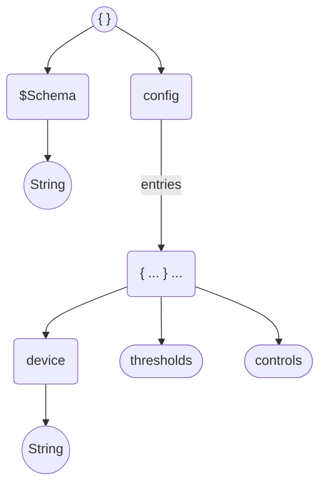
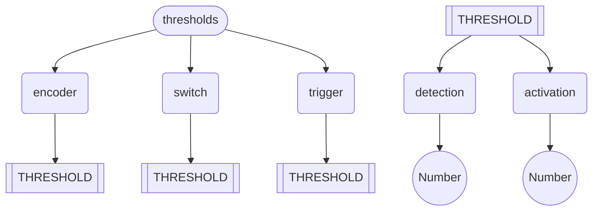
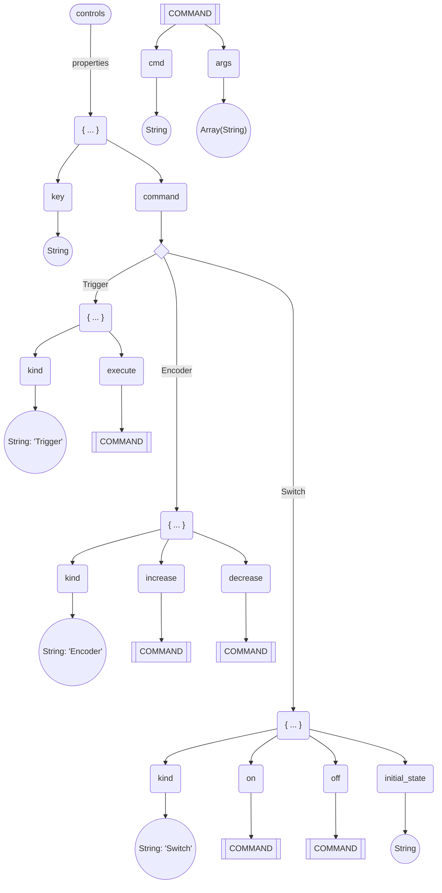

# The configuration file

This is a `JSON` file, named `midiboard.json`, that by default is expected to be located at `$HOME/midiboard.json`.

this documentation will define the data model and how to understand and write this file. It is heavily recommended to use the integrated tool to generate a skeleton, because it has a JSON Schema definition with descriptions for every key and some basic type/bounds checking.

## Concept

The idea of having a complex configuration for this program is to let the user define actions as code, having free reign into what one can do on actuation of a key, button or knob in the selected controller or controllers.

The program is designed to allow multiple devices with their own rules and definitions, keeping a runtime for each device on a separated thread. This means that if you want to have different configurations for completely different devices, all of it can live on a single file, keeping simple the daemonization process.

Tho achieve this goals, the `JSON` is structured to contain the schema location and a single key that contains an array with all the whole config entries:

| Property | Type          | Description                                         |
|----------|---------------|-----------------------------------------------------|
| `$Schema`  | String (enum) | Schema URI of the `JSON` file.                          |
| `config`   | Array (Object)        | List of all the config definitions, one per device. |

## Configuration object

Each config entry in the `config` array is an object, representing the whole config per each device. There can only be one device per object in the array.

The individual configuration is separated in three parts; `device`, `thresholds`,  and `controls`:

| Property  | Type   | Description                                                       |
|-----------|--------|-------------------------------------------------------------------|
| `device`    | String | Name of the device.                                               |
| `thresholds` | Object | Set of time thresholds for activating different kind of controls. |
| `controls`  | Object | Set of controls and its actions on activation.                    |

### `device`

Simply the name of the device as reported by ALSA. This value must be exact. To get the name you can either use the included tool `midiboard devices --list`, or use `aseqdump -l`.

### `thresholds`

List of thresholds. for every type of event. For more information on available events, thresholds, and how they differentiate, check the [events docs](https://github.com/aordano/midiboard/docs/events.md).

| Property | Type   | Description                              |
|----------|--------|------------------------------------------|
| `encoder`  | Object | Threshold data for any `Encoder` event.  |
| `trigger` | Object | Threshold data for any `Trigger` event.  |
| `switch`   | Object | Threshold data for any  `Switch`  event. |

Each threshold data object contains two keys, `detection`, and `activation`:

| Property   | Type   | Description                                                                                              |
|------------|--------|----------------------------------------------------------------------------------------------------------|
| `detection`  | Number | Minimum time, annotated in `ms`, for considering a detection event as successful.                        |
| `activation` | Number | Minimum time, annotated in `ms`, for considering an activation for any control that has this event type. |

## Controls

The `controls` key is where the meat of the config file is located.

Each child property (_you can name them as you want, as long as you only use a single word, in lowercase and/or digits, starting with a letter (not a digit), low dashes are ok too._) will be a chosen name for a given control.

| Property         | Type   | Description                                 |
|------------------|--------|---------------------------------------------|
| control name | Object | Object defining the given control behavior. |

Each control has three properties; `key`, `kind`, and `command`:

| Property  | Type          | Description                                                                                       |
|-----------|---------------|---------------------------------------------------------------------------------------------------|
| `key`     | Number        | Numeric value representing the key associated with this control, on the corresponding device.     |
| `command` | Object        | Object defining the command(s) to execute on a successful activation of the control.              |

You can get the value of the `key` (the activated controller on the midi device) using the included tool `midiboard devices --input <DEVICE_NAME>` or with `aseqdump -p <PORT_NUMBER>`.

## Command

This entry has three sets of possible children. What children does it have depends on the kind of event associated to the command. It always has a `kind` property that defines what type of event is associated with, and the correct keys for the command data.

| Property     | Type          | Description                                                                                                   |
|--------------|---------------|---------------------------------------------------------------------------------------------------------------|
| `kind`       | String (enum) | Event type to understand the control behavior as. Options are  ` Encoder ` ,  ` Switch ` , and  ` Trigger ` . |
|  valid keys | Object        | Valid key depends on selected `kind` of event.                                                                |

For more information on the event types check the [events docs](https://github.com/aordano/midiboard/docs/events.md).

### Command definition object

Every one of the keys described as "Command definition object" contain this common object describing what command to execute:

| Property | Type           | Description                                                            |
|----------|----------------|------------------------------------------------------------------------|
| `cmd`    | String         | Main command to execute. Must be in `$PATH` or a script file location. |
| `args`   | Array (String) | List of arguments to add to the given command.                         |

### `Encoder` kind

Encoders execute different commands on rising values (turning a knob or sliding a fader incrementing the detected value) or falling values (turning a knob or sliding a fader decreasing the detected value).

| Property | Type          | Description                                                                 |
|----------|---------------|-----------------------------------------------------------------------------|
| `kind`   | String (enum) | Event type to understand the control behavior as. Selected as ` Encoder ` . |
| `increase` | Object        | Command definition object for executing on detection of a rising value.     |
| `decrease` | Object        | Command definition object for executing on detection of a falling value.    |

### `Switch` kind

Switchs hold a binary state and alternate between both states, executing a different command on every state change.

| Property        | Type          | Description                                                                     |
|-----------------|---------------|---------------------------------------------------------------------------------|
| `kind`          | String (enum) | Event type to understand the control behavior as. Selected as `Switch`.         |
| `on`            | Object        | Command definition object for executing on setting the state as `ON`.           |
| `off`           | Object        | Command definition object for executing on setting the state as `OFF`.          |
| `initial_state` | String (enum) | Initial state to consider the control as being in, at the start of the program. |

### `Trigger` kind

Triggers just execute a single command on a successful activation.

| Property  | Type          | Description                                                                      |
|-----------|---------------|----------------------------------------------------------------------------------|
| `kind`    | String (enum) | Event type to understand the control behavior as. Selected as `Trigger`.         |
| `execute` | Object        | Command definition object for executing on successful activation of the control. |

## The full tree

To make it clearer and to more easily understand the big picture, i added some diagrams that encapsulate the config hierarchy tree:

### Config entry tree

### Thresholds tree

### Controls tree

