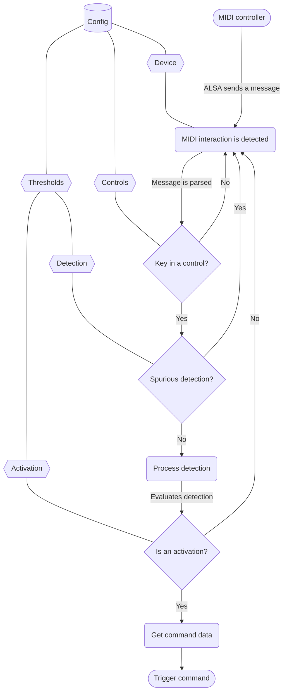

# Events docs

<!-- vscode-markdown-toc -->
* 1. [Event pipeline](#Eventpipeline)
* 2. [Debouncing and time thresholds](#Debouncingandtimethresholds)
* 3. [Event types](#Eventtypes)
  * 3.1. [`Encoder`](#Encoder)
    * 3.1.1. [How it works](#Howitworks)
    * 3.1.2. [How is it configured](#Howisitconfigured)
  * 3.2. [`Switch`](#Switch)
    * 3.2.1. [How it works](#Howitworks-1)
    * 3.2.2. [How is it configured](#Howisitconfigured-1)
  * 3.3. [`Trigger`](#Trigger)
    * 3.3.1. [How it works](#Howitworks-1)
    * 3.3.2. [How is it configured](#Howisitconfigured-1)

<!-- vscode-markdown-toc-config
	numbering=true
	autoSave=true
	/vscode-markdown-toc-config -->
<!-- /vscode-markdown-toc -->

## 1. <a name='Eventpipeline'></a>Event pipeline

Events happen after the program receives from ALSA a message informing that one of the keys associated with a control (as defined in the config file) has been triggered. The system interprets messages corresponding with each control in different ways depending of the kind of event  the control has ben configured as.

This program waits for ALSA to emit a message originated from the selected device. Then the message is parsed and used to discriminate if it matches any of the keys defined in the configuration.

If it doesn't match, it discards it and keeps waiting. If it matches, it checks that the time since the last same event is above the detection threshold. If it isn't, it discards it and keeps waiting.

If the elapsed is above the detection threshold, it registers the detection and processes it according to the rules for the corresponding event kind.

If after the processing, the elapsed time is above the activation threshold then it gets the command to execute according to the config and triggers the set command.



## 2. <a name='Debouncingandtimethresholds'></a>Debouncing and time thresholds

Due to the relatively fast polling (for human interaction scale) rate of the device, it's necessary to [debounce](http://www.interfacebus.com/Glossary_Switch_Debounce.html)the detections.

To do this,the program depends on two independent time thresholds; the _detection_ threshold, and the _activation_ threshold.

The detection threshold is the minimum time elapsed since the last successful detection that needs to pass before the MIDI message is used and considered for detection. This threshold is a very small frame intended to completely disregard spurious detections.

The activation threshold is the minimum time elapsed since the last successful activation that needs to pass before another activation can happen. This threshold is considerably larger than the detection one, and is intended to limit the frequency of succesful event triggering.

## 3. <a name='Eventtypes'></a>Event types

There are three mevent types available, intended to be able to be mapped to different kind of actions and controls. The underlying debounce and processing logic is different on each one, but for usage the only differences are when and what they execute.

### 3.1. <a name='Encoder'></a>`Encoder`

#### 3.1.1. <a name='Howitworks'></a>How it works

The `Encoder` event type is designed to match more or less the behavior that one would reasonably expect from a knob or a fader; if one turns a knob towards one direction, for example to increase the volume, the expectation is that it will keep doing it until reaching the maximum value.

This implies that events from knobs or faders, to match this expectation, should repeatedly execute the set commands as long as one keeps moving them in the same direction.

In the same vein, a knob or fader is comprised of extremes; they have a position where the value is larger and a position where the value is smaller. This means that te direction one moves it towards has some meaning, to either increase or decrease the value.

This implies that events from knob or faders, to match this expectation, should do different things when being moved in different directions.

To achieve this goals, the controls configured with `Encoder` event type will take a sample of values before deciding if the used is trying to increase or decrease the value.

#### 3.1.2. <a name='Howisitconfigured'></a>How is it configured

`Encoder`s entries contain two keys besides the mandatory `kind`; `increase` and `decrease`.

The command defined on the `increase` key will be executed when the values are detected to be increasing, and the command defined on the `decrease` key will be executed when the values are detected to be decreasing.

> example:
>
> ```JSON
> "volume": {
>      "key": 114,
>      "command": {
>          "kind": "Encoder",
>          "increase": {
>              "cmd": "pactl",
>              "args": ["set-sink-volume", "@DEFAULT_SINK@", "+3%"]
>          },
>          "decrease": {
>              "cmd": "pactl",
>              "args": ["set-sink-volume", "@DEFAULT_SINK@", "-3%"]
>          }
>      }
> },
> ```

### 3.2. <a name='Switch'></a>`Switch`

#### 3.2.1. <a name='Howitworks-1'></a>How it works

The `Switch` event type is designed to match more or less the behavior that one would reasonably expect from a switch (whether the actual input element is a key, a pad, or an actual button); once one presses the switch, it should change state, alternating between two possible states, never actuating one if it's already selected.

This implies that if a switch is in the `ON` position, pressing it won't make another `ON` command happen, one would expect the switch would univocally trigger an `OFF` event.

In the same vein, a switch can be found in any of the two states, say `ON`. The first time the switch is activated since you found it will mutate it to the other state, `OFF`.

This implies that it is important to be able to configure an initial state, to avoid having to fiddle with the input on first activation.

To do this, controls associated with `Switch` events have their state tracked and can only alternate between states.

#### 3.2.2. <a name='Howisitconfigured-1'></a>How is it configured

`Switch` entries contain three keys besides the mandatory `kind`; `on`, `off`, and `initial_state`.

The command defined on the `on` key will be executed when the state changes **from** `OFF` **to** `ON`, and the command defined on the `off` key will be executed when the state changes **from** `ON` **to** `OFF`. The `initial_state` key will determine what is considered to be the initial state of the switch when the runtime initializes.

> example:
>
> ```JSON
> "mute_audio": {
>      "key": 47,
>      "command": {
>          "kind": "Switch",
>          "on": {
>              "cmd": "pactl",
>              "args": ["set-sink-mute", "@DEFAULT_SINK@", "0"]
>          },
>          "off": {
>              "cmd": "pactl",
>              "args": ["set-sink-mute", "@DEFAULT_SINK@", "1"]
>          },
>          "initial_state": "OFF"
>      }
> },
> ```

### 3.3. <a name='Trigger'></a>`Trigger`

#### 3.3.1. <a name='Howitworks-1'></a>How it works

The `Switch` event type is designed to match more or less the behavior that one would reasonably expect from a push button (whether the actual input element is a key, a pad, or an actual button); once one presses the button, it should do something. If you press it again, it does it again.

This implies that there is no need to either track state or evaluate if the values increase or decrease, the only thing needed is a command to execute and an activation threshold for the debounce.

#### 3.3.2. <a name='Howisitconfigured-1'></a>How is it configured

`Trigger` entries contain a single key besides the mandatory `kind`; `execute`.

The command defined on the `execute` key will be executed when the activation is deemed successful. If the control is activated again, it will execute the command again.

> example:
>
> ```JSON
> "play_pause": {
>      "key": 43,
>      "command": {
>          "kind": "Trigger",
>          "execute": {
>              "cmd": "playerctl",
>              "args": ["play-pause"]
>          },
>      }
> },
> ```
