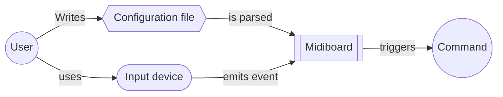

# Midiboard Docs

This tool lets the user associate any executable commands to actions in one or more MIDI devices, like changing volume, altering backlight level, changing a song, starting/stopping a service, or launching any script/executable, on the press of a button or turn of a knob.

## Installation

It is recommended you install via Cargo.

### Cargo

   ```bash
   cargo install midiboard
   ```

### Manual

1. Clone

   ```bash
   git clone https://github.com/aordano/midiboard.git
   ```

2. Build

   ```bash
   cd midiboard
   cargo build --release
   ```

3. Copy binary

   ```bash
   sudo cp ./target/release/midiboard /usr/bin/midiboard

## Concept

The concept is to have an arbitrary configuration that serves as a source of truth to define a data model that can be executed upon activation of the determined input:



## Usage

Before using this tool it requires to be configured, then it can be run via CLI either manually or as a daemon.

For more information on the CLI options check out the [CLI docs](https://github.com/aordano/midiboard/tree/master/docs/cli.md).

## Configuration

First, it is heavily recommended to generate a skeleton config file.  The configuration is complex and this skeleton includes the correct `JSON` schema, which provides some basic linting, integrated documentation, and type/bounds checking. Of course this is useless Without an editor that can interpret the schema.

```bash
midiboard config --generate
```

By default, the configuration is generated at `$HOME/midiboard.json`. You can change the output via the `--path` argument if you need to:

```bash
midiboard config --generate --path <FULL PATH>
```

### Getting the device

Once you have a config skeleton, you first need to populate the device to use. To do this first you need to get the display name advertised to ALSA by the MIDI device of your choice.

To get the name of all connected MIDI devices you can use the included utility:

```bash
midiboard devices --list
```

> example:
>
>```bash
> $ midiboard devices --list
> 
> [2022-10-26T10:59:50-03:00] [INFO] Currently connected devices:
> 
> [2022-10-26T10:59:50-03:00] Midi Through
> [2022-10-26T10:59:50-03:00] Arturia BeatStep
> [2022-10-26T10:59:50-03:00] X6 Mini
> 
 > ```

If for some reason this doesn't display correctly the name, you can get it directly via ALSA using `aseqdump -l` (if that happens please file an issue).

Once you are armed with the name, you need to add it to the configuration, in the `device` field:

> example:
>
> ```JSON
> "config": [
>         {
>             "device": "Arturia Beatstep",
>             "thresholds": {
>                 ...
>                 ...
>                 ...
> ```

 This tool supports multiple devices, each one with their own fully independent configuration. If you noticed, the `config` field is an _Array_. To add config for another decive you just need to replicate the same object as another entry in the `config` list:

 > example:
>
> ```JSON
> "config": [
>         {
>             "device": "Arturia Beatstep",
>             "thresholds": {
>                 ...
>                 ...
>                 ...
>         },
>         {
>             "device": "X6 Mini",
>             "thresholds": {
>                 ...
>                 ...
>                 ...
>         }
>     ]
> ```

### Managing thresholds

The `thresholds` key inside the config data defines what are the time thresholds to consider when [debouncing](http://www.interfacebus.com/Glossary_Switch_Debounce.html) the input. MIDI is a digital protocol, so debouncing input shouldn't be necesary, but encoders, and "sensitive" keys or pads update their [velocity](https://electronicmusic.fandom.com/wiki/Velocity) very fast (for human timescales), which makes it a requirement.

For most uses, the default thresholds present on the skeleton are fine. You can tune them according to your needs or the quirks of your device. For more information check the [event docs](https://github.com/aordano/midiboard/tree/master/docs/events.md).

### Defining controls

#### Naming

Controls are defined as user-defined keys under the `controls` field.

User defined names need to adhere to this rules:

- Only letters (a-z), both lowercase and uppercase, digits (0-9), and lodash are accepted as valid.
- Must start with a lowercase letter
- Must be a single word
- Be unique

> valid examples:
>
> ```JSON
> "controls": {
>             "potato_masher1": {
>                 ...
>             },
>             "potato_masher1_automatic": {
>                 ...
>             },
>             "volume": {
>                 ...
>             },
>             "coffeeMACHINE": {
>                 ...
>             },
>        }
> ```

Make sure each control is descriptive, as its name is used in error messages and logs.

#### Getting the key value

Each control has two fields, `key` and  `command`. `key` is a numeric value that represents the input you want associated with the control. `command` is an object containing the thing to trigger once the control is activated successfully.

To get the numeric value of a key you can use the included utility:

```bash
midiboard devices --input <DEVICE NAME>
```

> example (I slightly turned a knob):
>
>```bash
> $ midiboard devices --input "Arturia Beatstep"
> 
> [2022-10-26T11:30:52-03:00] [INFO] Opening connection...
> [2022-10-26T11:30:52-03:00] [SUCCESS] Connection open, listening events from Arturia Beatstep
> [2022-10-26T11:30:52-03:00] [INFO] Press any key to stop listening
>
> [2022-10-26T11:30:54-03:00] key: 114, value: 65
> [2022-10-26T11:30:54-03:00] key: 114, value: 66
> [2022-10-26T11:30:54-03:00] key: 114, value: 67
> [2022-10-26T11:30:54-03:00] key: 114, value: 68
> [2022-10-26T11:30:54-03:00] key: 114, value: 69
> [2022-10-26T11:30:55-03:00] key: 114, value: 70
> [2022-10-26T11:30:55-03:00] key: 114, value: 71
> [2022-10-26T11:30:55-03:00] key: 114, value: 72
> [2022-10-26T11:30:55-03:00] key: 114, value: 73
> [2022-10-26T11:30:55-03:00] key: 114, value: 74
> [2022-10-26T11:30:55-03:00] key: 114, value: 73
> [2022-10-26T11:30:55-03:00] key: 114, value: 72
> [2022-10-26T11:30:55-03:00] key: 114, value: 71
> [2022-10-26T11:30:55-03:00] key: 114, value: 70
> [2022-10-26T11:30:55-03:00] key: 114, value: 69
> [2022-10-26T11:30:56-03:00] key: 114, value: 70
> [2022-10-26T11:30:56-03:00] key: 114, value: 71
>
> [2022-10-26T11:30:58-03:00] [INFO] Connection closed.
>
 > ```

If for some reason this doesn't display correctly or doesn't work, you can get it directly via ALSA using `aseqdump -p <PORT NUMBER>` (if that happens please file an issue).

This lets you play around with the device inputs and get the values of each key/controller as needed.

Once you have the value, you need to add it (as number) on the config:

> example:
>
> ```JSON
> "controls": {
>             "volume": {
>                 "key": 114,
>                 ...
>             },
>
>             ...
>             ...
>             ...
>        }
> ```

### Writing the commands

For each control you define you can have one or more commands to execute on successful activation. How you define a command depends on the kind of event triggered. Different kinds of events map to different kind of actions in the real world, which implies a need to do different things on each one.

To solve this issue, each control has a `kind` field, that defines the kind of event associated with detections of the associated key, and also defines how to build the rest of the command.

`kind` is a string that can take any of three values: `Encoder`, `Switch`, and `Trigger`, corresponding to each event type.

> example:
>
> ```JSON
> "controls": {
>             "volume": {
>                 "key": 114,
>                 "command": {
>                     "kind": "Encoder",
>                      ...
>                 }
>             },
>
>             ...
>             ...
>             ...
>        }
> ```

The rest of the valid fields on the command _depend on the event type defined on the `kind` field_.

For more information check the [event docs](https://github.com/aordano/midiboard/tree/master/docs/events.md).

#### Anatomy of a command definition

Regardless of the kind of event associated with a command, the data you need to add to the configuration to define what a command will execute on activation will always be the same. This is an object with two fields, `cmd`, and `args`. `cmd` defines the main command (found in `$PATH`) or script path to execute. `args` is an array of strings defining possible arguments for the command.

> example:
>
> ```JSON
> {
>    "cmd": "pactl",
>    "args": ["set-sink-volume", "@DEFAULT_SINK@", "+3%"]
> }
> ```
>
> _That is equivalent to running `pactl set-sink-volume @DEFAULT_SINK@ +3%` on a terminal._

The given command will be executed on a newly spawned shell.

#### Encoder commands

`Encoder` commands are designed to map in a more-or-less natural way to knobs found on most common MIDI controllers. The defining characteristic of this kind of commands is that they have a command to execute when the velocity decreases (i.e. turning knob to the left or sliding down a fader), and a different command when it increases (i.e. turning a knob to the right or sliding up a fader).

This command keeps activating itself if it keeps detecting further increases or decreases on the velocity; this means that if the values keep increasing within the given thresholds, what is configured to be executed on increasing values will keep executing again, ad viceversa.

`Encoder` commands contain two keys besides `kind`; `increase` and `decrease`. Both contain a command definition, to either execute on increasing or decreasing values.

> example:
>
> ```JSON
> "volume": {
>      "key": 114,
>      "command": {
>          "kind": "Encoder",
>          "increase": {
>              "cmd": "pactl",
>              "args": ["set-sink-volume", "@DEFAULT_SINK@", "+3%"]
>          },
>          "decrease": {
>              "cmd": "pactl",
>              "args": ["set-sink-volume", "@DEFAULT_SINK@", "-3%"]
>          }
>      }
> },
> ```

For more information check the [event docs](https://github.com/aordano/midiboard/tree/master/docs/events.md).

#### Switch commmands

`Switch` commands are designed to map in a more-or-less natural way to pads, keys and buttons found on most common MIDI controllers. The defining characteristic of this kind of commands is that they keep state to be able to reliably switch between "ON" and "OFF" states.

This command will only switch from "ON" state to "OFF" state and viceversa, not being able to execute more than one instance of the command associated with a given state before doing the other.

`Switch` commands contain three keys besides `kind`; `on`, `off`, and `initial_state`. Both `on` and `off` contain a command definition, to execute on setting either state. `initial_state` is a string that can take the values `ON` or `OFF` to represent either state as the one existing at runtime initialization.

> example:
>
> ```JSON
> "mute_audio": {
>      "key": 47,
>      "command": {
>          "kind": "Switch",
>          "on": {
>              "cmd": "pactl",
>              "args": ["set-sink-mute", "@DEFAULT_SINK@", "0"]
>          },
>          "off": {
>              "cmd": "pactl",
>              "args": ["set-sink-mute", "@DEFAULT_SINK@", "1"]
>          },
>          "initial_state": "OFF"
>      }
> },
> ```

For more information check the [event docs](https://github.com/aordano/midiboard/tree/master/docs/events.md).

#### Trigger commands

`Trigger` commands are designed to map in a more-or-less natural way to pads, keys and buttons found on most common MIDI controllers. The defining characteristic of this kind of commands is that they have a single command to execute, repeated on each successful activation.

`Trigger` commands contain only one key besides `kind`; `execute`. It contains the command definition to execute on trigger.

> example:
>
> ```JSON
> "play_pause": {
>      "key": 43,
>      "command": {
>          "kind": "Trigger",
>          "execute": {
>              "cmd": "playerctl",
>              "args": ["play-pause"]
>          },
>      }
> },
> ```

For more information check the [event docs](https://github.com/aordano/midiboard/tree/master/docs/events.md).

### Validation

With all that covered, you can fully complete your config file. To avoid the need to run this program and check if you crash or not, a utility exposes the parser and lets you validate the file:

```bash
midiboard config --validate
```

By default, the configuration is generated at `$HOME/midiboard.json`. You can change the output via the `--path` argument if you need to:

```bash
midiboard config --validate --path <FULL PATH>
```

> example for a valid file:
>
> ```bash
> $ midiboard config --validate
>
> [2022-10-26T12:50:29-03:00] [SUCCESS] Config file validated correctly.
> ```

> example for an invalid file:
>
>
> Bad part of the file:
>
> ```JSON
> ...
>
> "volume": {
>      "key": 114,
>      "command": {
>          "kind": "Encoder",
>          "decrease": {
>              "cmd": "pactl",
>              "args": ["set-sink-volume", "@DEFAULT_SINK@", "-3%"]
>          }
>      }
> },
>
> ...
> ```
>
>
> Validation:
>
> ```bash
> $ midiboard config --validate
>
> [2022-10-26T12:51:19-03:00] [FATAL] missing field `increase`
> ```

## Running

### Manually

By default it will expect a config file at `$HOME/midiboard.json`.Optionally add a `--path` flag to change the output location:

   ```bash
   midiboard run
   ```

### Daemonized

1. Get the service file

   ```bash
   wget -O midiboard.service https://raw.githubusercontent.com/aordano/midiboard/master/schema/midiboard.service
   ```

2. Move the service file

   ```bash
   sudo mv midiboard.service /etc/systemd/system/midiboard.service
   ```

   The file uses the default config location. Modify the service file if you have an alternate path for the config file (add the `--path` flag).

3. Enable the service

   ```bash
   sudo systemctl daemon-reload
   sudo systemctl enable --now midiboard
   ```

## The config file

For more information on the config file check the [config docs](https://github.com/aordano/midiboard/tree/master/docs/config.md).

## Events

For more information on events check the [event docs](https://github.com/aordano/midiboard/tree/master/docs/events.md).

## CLI

For more information on the CLI options check out the [CLI docs](https://github.com/aordano/midiboard/tree/master/docs/cli.md).
